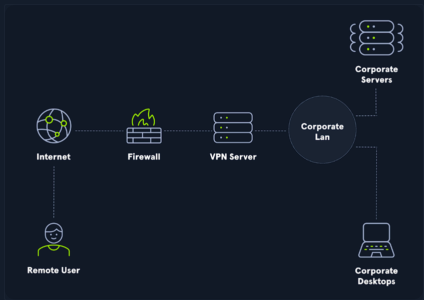

# Notes

---

## Table of Contents

- [Summary](#summary)
- [VPNs](#vpn)
- [PenTest Basics](#pentest-basics)
    - [PenTest Tools](#pentest-tools)
    - [Service Scanning](#service-scanning)
    - [Shell Types](#shell-types)

---

## Summary

This is a summary - made by me, Lance Wilson - of things that you will learn in this HackTheBox guide.  
 
**Why read these notes?**  
 
These notes not only help you understand the fundamentals of cybersecurity, but you will also see my interpretation of said cybersecurity concepts. You will understand concepts differently than how I would, so **DO NOT USE THIS GUIDE AS A SUBSTITUTE OF YOUR LEARNING!**

That's it from me.

---

## VPNs

**What are VPNs?** - A virtual private network (VPN) enables the user to connect to another network. 
**What can we do?** - We can access hosts and resources as if we were connected to the target network. 

*For example:*
I want to watch a fight scene from Naruto Shippuden on YouTube, but I need to "be in Japan" to stream the video - I can't watch it in my bedroom in the US. What can I do? 
One option is to **go to Japan.** But let's be real. I would need many extra things - passport, check-in luggage, etc. - and I only need to stream a video! It's just crazy to spend thousands on a trip to Japan, and the sole purpose is to stream a video. 🤦🏽‍♂️
Another option is to ***use a VPN to connect to a server** - in this case, a server in Japan - to stream the video. It's so much simpler to do that than to spend thousands of dollars and waste time!

**How does it work?** 

- VPN works by routing our connecting device's internet connection through the target VPN's private server instead of our internet service provider (ISP). When connected to a VPN, data originates from the VPN server rather than our computer and will appear to originate from a public IP address other than our own.
- VPNs provide a degree of privacy and security by encrypting communications over the channel 

**I've heard that there are two types of VPNs. What are they?**

They are:

- Client-based VPN: requires the use of client software to establish the connection.
- SSL VPN: Uses the web browser as the client.

---

